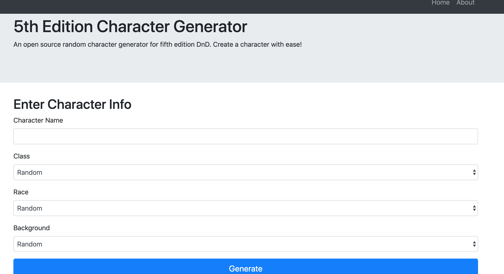

# PC-generator

Web application that generates characters for use in DnD 5e roleplaying game

### Technology Used

**Tools and Frameworks**
Front-End:
- HTML/CSS/Javascript 
- Bootstrap
Back-End:
- Python 
- Flask
- REST API

## Usage

**Note:** The app will be deployed to Heroku soon



Fill out the forms on the home page. The name form is required. Then click generate. View the results on the results page, or print a PDF copy using the print button.

## Development

### Getting Started
1 Look up info on Command Line Interface / download for windows: https://www.cygwin.com/
2 Look up info on git and git workflow
3 Make a local directory and clone this repo:
```
git clone https://github.com/warussel/PC-generator.git
```
4 Look up python basics / object oriented program with python
  *** Python is the primary language we will be coding in for this project ***
5 Look up XML formatting basics

### Daily Workflow
For more info, read here: https://help.github.com/en/github/using-git/using-common-git-commands
Fetch and merge any changes: 
``` 
git fetch
git merge
```
After work, commit and push completed changes:
```
git add FILENAME
git commit -m "MESSAGE"
git push -u origin develop
```
Resolve any merge conflicts: https://help.github.com/en/github/collaborating-with-issues-and-pull-requests/addressing-merge-conflicts
